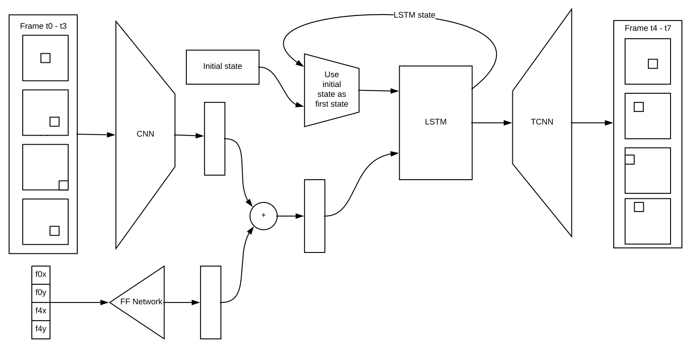
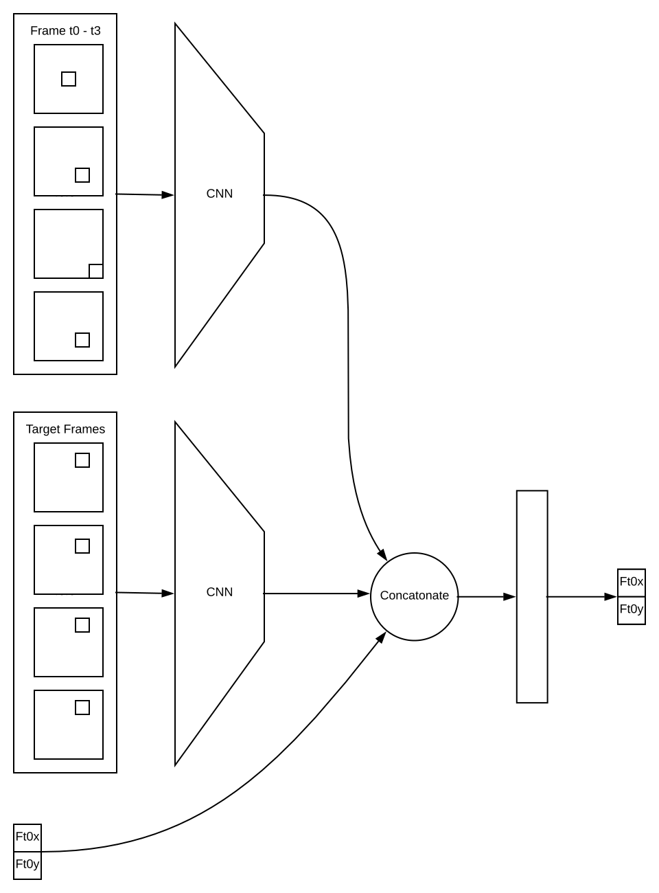

# Description 
Pytorch project as an experiment in model based reinforcement learning.

This isn't however model based reinforcement learning in the strictest sense as the process is effectively:
1.  Train model via random inputs and initial conditions in the world.
2.  Train policy back propogating through model using random initial conditions and random targets.

So it is effectively just supervised learning with a simulator.
The component I was curious about testing was whether I could train a policy by backpropogating through a complex model.
The answer seems to be yes although to be fair the learned policy is only simple and it doesn't have to plan over a long horizon.

I built a simple physics simulator in numpy.  It contains a block moving in a fixed square space where the velocity reverses on impact with a wall (bounce).  Forces can be applied at each time step.
So essentially the block can be moved to a target location by applying the right forces to guide it there.

The model operates on sets of 4 frames rather than each frame so each timestep is considered as 4 frames.
If we consider t0 to be the first 4 frames and t1 to be the next 4 frames the aim of model is to predict the next 4 frames at t1.

Similarly the forces at are held constant for each 4 frame timestep.

Primarily trained on Google Kubernetes Engine on GPUs however it can
also be trained locally on cpu.
Pre-trained models included with the project.

# Local Installation for testing
Run: `make install`

# Using Pre-trained models
This project includes the pre-trained pytorch modules for model and policy as well as some scripts for testing and interacting with the models.

## Run interactive Demo with Pretrained model
Generates frames using the model open-loop by feeding back the models own output into the model so error increases on time.
`make draw_test_policy`

## Generate test model frames
Generates frames using the model open-loop by feeding back the models own output into the model so error increases on time.
`make clean`
`make draw_test_policy`

## Generate test policy frames
Generates frames using the model and policy by feeding the simulator output into the policy and model.
`make clean`
`make draw_test_policy`

# Setting up kubernetes project
Requires a Google cloud account.
1.  Setup Google Kubernetes Engine project and create a new cluster (It doesn't matter what nodes are there just delete them afterwards).
2.  Create a file in the root directory called GKE_PROJECT.  Inside the file insert the GKE Project name.
3.  Create a file in the root directory called GKE_ClUSTER.  Inside the file insert the GKE CLUSTER name.
4.  run `bash setup_gke` to bind kubectl to this cluster. 
5.  run `bash setup_model_storage.sh` to add a storage bucket used for the models to the project. 
6.  run `bash setup_kubeflow` to install kubeflow into your cluster.
Your kubernetes environment should now be ready to train the model once the node pools are created.

# Training locally
Requires Google Cloud storage to load / save model and policy.
To train the model run:
`bash start_model.sh`
To train the policy run:
`bash start_policy.sh`

# Training on GKE 
